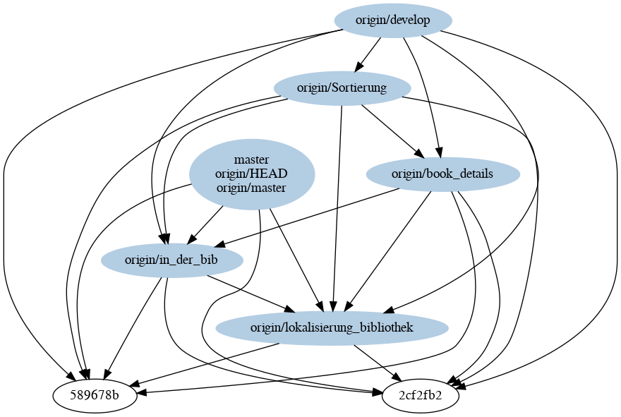
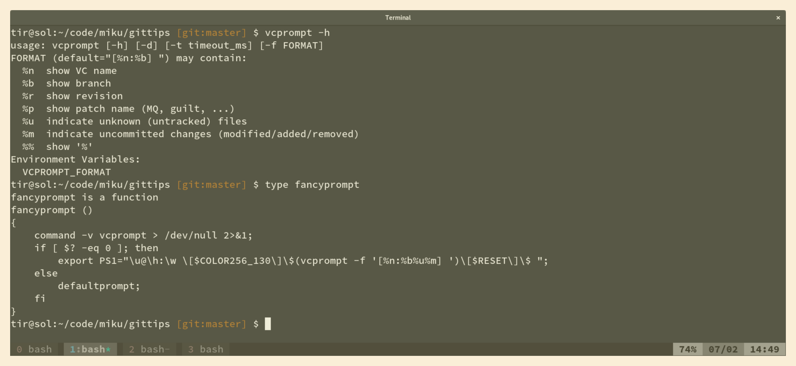
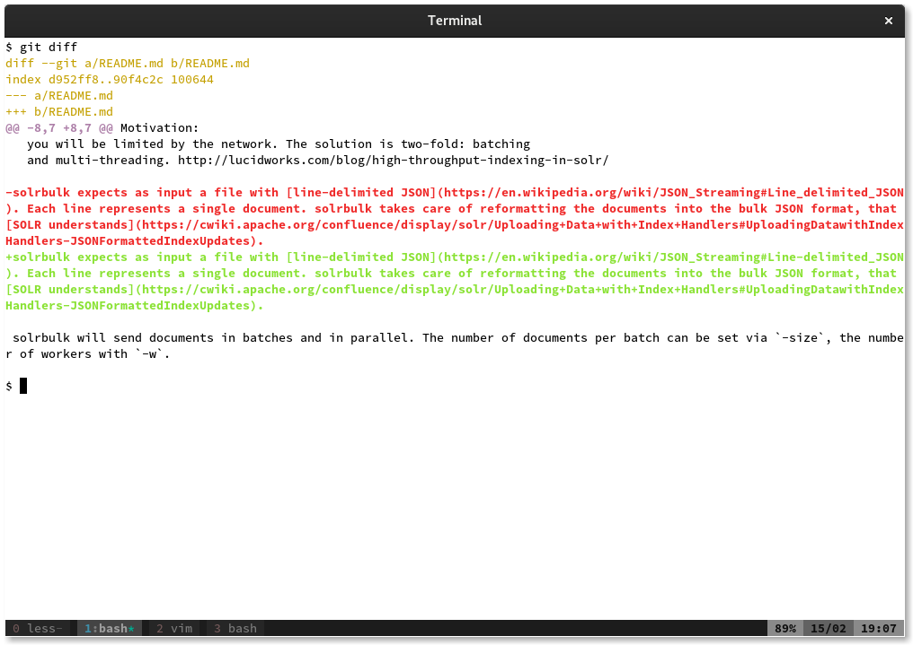
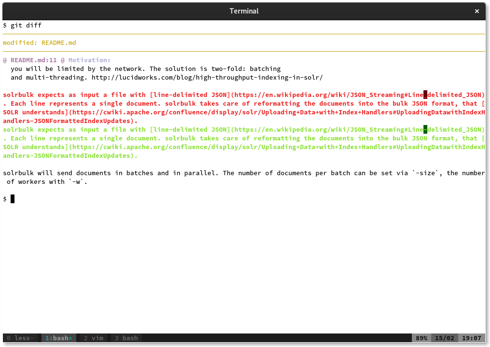

# Git Love

Git is a lovely tool. This repo collects a few things I use or found useful.
The goal is to show the versatility of the tool and that it can be fun to hack
the development process itself.

Prepared for DM18B, 2019-02-25, 12:30--13:30 meeting (Albertina, TDB).

## TOC

1. Git is a toolkit
2. Prompt playsi
3. Config bits
4. Edit, Patch, Rebase
5. Diff-so-fancy
6. The Clash
7. Local hooks
8. The git push workflow (remote hooks)
9. Stats (cal, theseus)
10. Wrap up, Resources

Other:

* git bisect example
* a git commit without git

----

## 1. git is a toolkit

Git is a collection of utilities, just a normal UNIX citizen.


* [https://git.kernel.org/pub/scm/git/git.git/about/](https://git.kernel.org/pub/scm/git/git.git/about/)

It became self-hosting within two weeks.

```shell
$ git clone https://git.kernel.org/pub/scm/git/git.git && cd git
$ git log --reverse | head -5
commit e83c5163316f89bfbde7d9ab23ca2e25604af290
Author: Linus Torvalds <torvalds@ppc970.osdl.org>
Date:   Thu Apr 7 15:13:13 2005 -0700

    Initial revision of "git", the information manager from hell

```

See: It's from hell and it started with a few hundred lines of C.

```shell
$ git reset --hard e83c5163316f89bfbde7d9ab23ca2e25604af290
HEAD is now at e83c516331 Initial revision of "git", the information manager from hell

$ tree -sh
.
├── [2.4K]  cache.h
├── [ 503]  cat-file.c
├── [4.0K]  commit-tree.c
├── [1.2K]  init-db.c
├── [ 957]  Makefile
├── [5.5K]  read-cache.c
├── [8.2K]  README
├── [ 986]  read-tree.c
├── [2.0K]  show-diff.c
├── [5.3K]  update-cache.c
└── [1.4K]  write-tree.c

0 directories, 11 files
```

Can we just build it today?

```shell
$ uname -sr # btw
Linux 4.20.6-arch1-1-ARCH

$ gcc --version
gcc (GCC) 8.2.1 20181127
Copyright (C) 2018 Free Software Foundation, Inc.
This is free software; see the source for copying conditions.  There is NO
warranty; not even for MERCHANTABILITY or FITNESS FOR A PARTICULAR PURPOSE.
```

Nah, two LIBS entries seem to be missing.

```shell
diff --git a/Makefile b/Makefile
index a6bba79ba1..aeb6d4b61a 100644
--- a/Makefile
+++ b/Makefile
@@ -8,7 +8,7 @@ all: $(PROG)
 install: $(PROG)
    install $(PROG) $(HOME)/bin/

-LIBS= -lssl
+LIBS= -lssl -lcrypto -lz

 init-db: init-db.o

```

The very first repo contained a seven executables already.

```
$ find . -maxdepth 1 -perm -111 -type f
./update-cache
./cat-file
./init-db
./write-tree
./show-diff
./read-tree
./commit-tree
```

Sun, 1 May 2005, [Quick git command
reference](https://lwn.net/Articles/134222/) - 29 commands.

Here is a repo full of git scripts:

* [https://github.com/jwiegley/git-scripts](https://github.com/jwiegley/git-scripts)
* [https://github.com/esc/git-big-picture](https://github.com/esc/git-big-picture)



You can add your own.

```shell
$ echo "bash -c 'echo Anything goes.'" > ~/bin/git-xyz && chmod +x ~/bin/git-xyz
$ git xyz
Anything goes.
```

> Although Git includes its own **porcelain** layer, its low-level commands are
> sufficient to support development of alternative porcelain. -- Documentation/git.txt

> Git is a fast, scalable, distributed revision control system with an
> unusually rich command set that provides both high-level operations and full
> access to internals.

Welcome to a short tour.

## 2. Prompt playsi

Spice up your prompt. Saves you an occasional git status. There are many versions:

* [git-prompt.sh](https://github.com/git/git/blob/master/contrib/completion/git-prompt.sh)
* [zsh-git-prompt](https://github.com/olivierverdier/zsh-git-prompt)
* [bash-git-prompt](https://github.com/magicmonty/bash-git-prompt)

### vcprompt



```shell
fancyprompt ()
{
    command -v vcprompt > /dev/null 2>&1;
    if [ $? -eq 0 ]; then
        export PS1="\u@\h:\w \[$COLOR256_130\]\$(vcprompt -f '[%n:%b%u%m] ')\[$RESET\]\$ ";
    else
        defaultprompt;
    fi
}
```

## 3. Config bits

## 4. Edit, patch, rebase, clean

* git clean -fd

## 5. Diff-so-fancy

The default is NICE.



But we can get FANCY as well:



Dark themed:


## 9. Stats


Install git-extras to get a few additional tools. Here, git summary on git:

```
$ git summary

 project  : git
 repo age : 14 years
 active   : 4788 days
 commits  : 54455
 files    : 3533
 authors  :
 20215  Junio C Hamano                  37.1%
  3047  Jeff King                       5.6%
  1612  Nguyễn Thái Ngọc Duy            3.0%
  1401  Shawn O. Pearce                 2.6%
  1324  Johannes Schindelin             2.4%
  1116  Linus Torvalds                  2.0%
   954  Michael Haggerty                1.8%
   842  René Scharfe                    1.5%
   819  Jonathan Nieder                 1.5%
   614  Stefan Beller                   1.1%
   569  Ævar Arnfjörð Bjarmason         1.0%
   547  Christian Couder                1.0%
   545  Eric Wong                       1.0%

```

### Git-of-Theseus

Have you heard of git-of-theseus?


## 10. Wrap up, Resources

There was a documentation effort at around git 1.5.0 (2010), since then lots of
documentations, books and more became available.

```man
$ man giteveryday

    giteveryday - A useful minimum set of commands for Everyday Git

Git users can broadly be grouped into four categories for the purposes of
describing here a small set of useful command for everyday Git:

* INDIVIDUAL DEVELOPER (STANDALONE)
* INDIVIDUAL DEVELOPER (PARTICIPANT)
* INTEGRATOR
* REPOSITORY ADMINISTRATION

```

* [More git tips](https://github.com/git-tips/tips)
* [git - the simple guide](http://rogerdudler.github.io/git-guide/), just a simple guide for getting started with git. no deep shit ;)
* [Visualizing Git](http://git-school.github.io/visualizing-git/)
* [Hacker Tools](https://hacker-tools.github.io/), covers
  [git](https://hacker-tools.github.io/version-control/) and asks [if git is
dark magic](https://hacker-tools.github.io/version-control/#is-git-dark-magic).
* [git exercises](https://gitexercises.fracz.com/)
* [gitignore.io](https://www.gitignore.io)
* `git commit --amend`, hooks (e.g. for automatically create a version string)

What is a detached HEAD? How to write a good a commit message.
